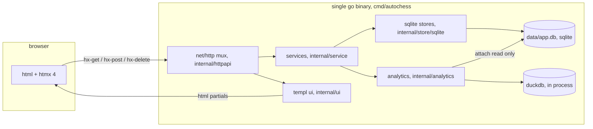
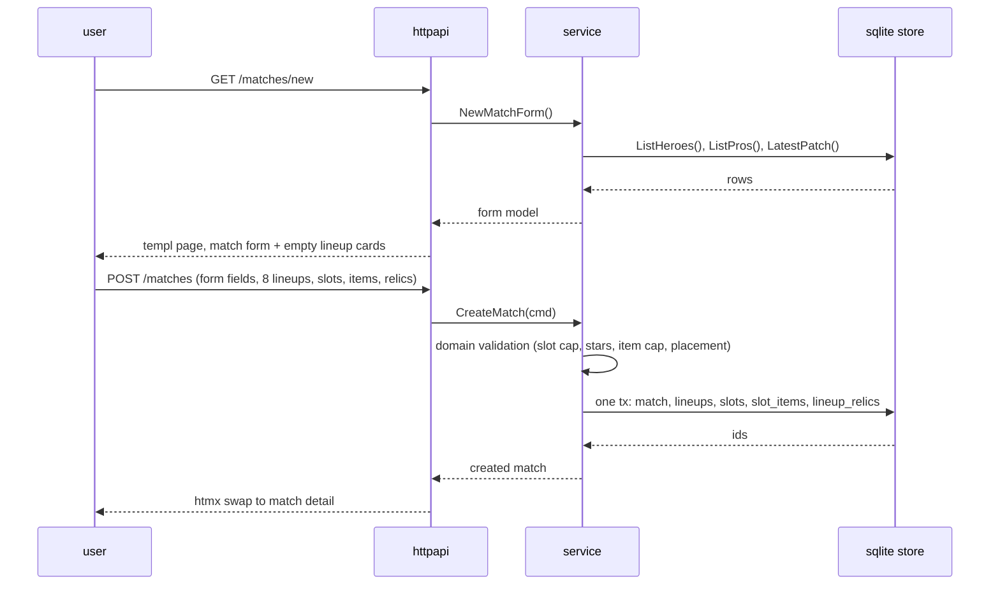
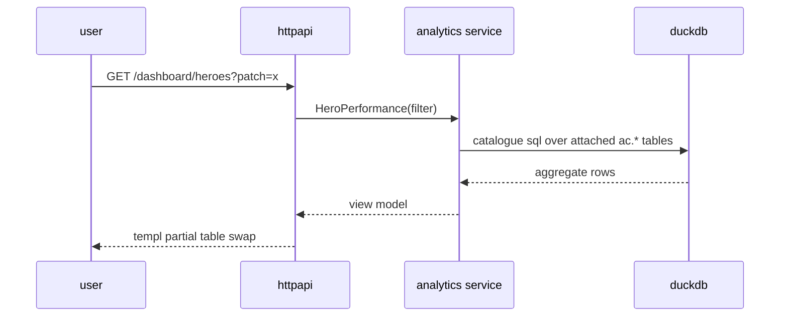
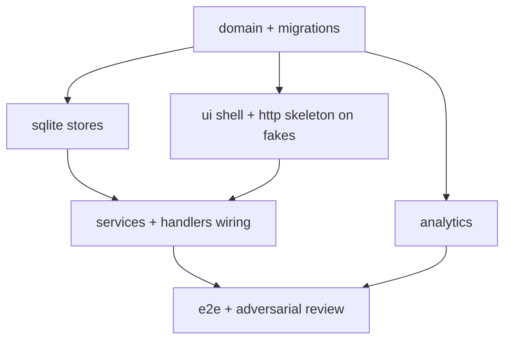

# autochess companion

## tech stack

- sqlite for transactional queries
- duckdb for analytical queries
- go 1.27+ + templ + htmx 4
- tdd + dag plan for parallel development (max 4 agents) + e2e run each feature with fake data but full interactions & adversarial review agents & regression prevention. we move slow but guarantee
- the architecture should be the simplest KISS that can satisfies the requirements but still DRY, everything should be bottom-up and from first principles
- verified pins (2026-09-23): go 1.27, templ v0.3.1020, htmx 4.0.0 vendored (npm next tag, latest still 2.x), github.com/duckdb/duckdb-go v2.5+ bundling duckdb 1.5.x, mattn/go-sqlite3, pressly/goose/v3 embedded, pgregory.net/rapid, playwright-community/playwright-go

## purpose

- since there's no online database for autochess (mobile/standalone steam) and all the wikis are severely outdated so this will be a place for me to, at first, manually enter the information regarding races/classes, heroes, items, relics, etc.
- my personal match history, again, ui for enter manually for now, and accumulative lineup history where i check match history of top leaderboard pros and enter 8 line up for each of their match in (final 12 heroes deck, relics taken, w-d-l ratio, networth, items taken for each hero)
- analytical dashboard where it use maths, algs, and data mining techniques to give me insights into the meta and the objective performance of heroes or synergies/lineups or relics or itemization
- we can look into automating info capture from game window if possible, but for this first mvp we need a complete skeleton so manual data entry is expected, and database files also get committed

## architecture

### preliminary design

#### overview

one process. sqlite is the only persistent store and the source of truth, duckdb is a derived read-only view over it. html is server rendered by templ, htmx swaps partials, there is no client framework and no json api.



#### e2e sequence flow

data entry:



analytics read:



### detailed design

bottom-up, each layer only talks to the layer directly below, max 400 sloc per file.

#### layer 0: data

- data/app.db, sqlite, journal_mode=TRUNCATE (no wal), committed to git. no sidecar files exist; commit the db while the app is closed or idle, and a git pre-commit hook rejects a stray app.db-journal.
- migrations are embedded numbered .sql files applied automatically at boot, one tx each (goose v3, programmatic only). no manual migration steps ever, and the app has no docker services at all.

```sql
-- v1 schema
CREATE TABLE patches (
  id INTEGER PRIMARY KEY, version TEXT NOT NULL UNIQUE, released_at TEXT NOT NULL);
CREATE TABLE races (
  id INTEGER PRIMARY KEY, name TEXT NOT NULL UNIQUE);
CREATE TABLE race_tiers (
  race_id INTEGER NOT NULL REFERENCES races(id),
  count INTEGER NOT NULL, effect TEXT NOT NULL,
  PRIMARY KEY (race_id, count));
CREATE TABLE classes (
  id INTEGER PRIMARY KEY, name TEXT NOT NULL UNIQUE);
CREATE TABLE class_tiers (
  class_id INTEGER NOT NULL REFERENCES classes(id),
  count INTEGER NOT NULL, effect TEXT NOT NULL,
  PRIMARY KEY (class_id, count));
CREATE TABLE heroes (
  id INTEGER PRIMARY KEY, name TEXT NOT NULL UNIQUE,
  cost INTEGER NOT NULL CHECK (cost BETWEEN 1 AND 5),
  ability TEXT NOT NULL DEFAULT '', notes TEXT NOT NULL DEFAULT '');
CREATE TABLE hero_races (
  hero_id INTEGER NOT NULL REFERENCES heroes(id) ON DELETE CASCADE,
  race_id INTEGER NOT NULL REFERENCES races(id),
  PRIMARY KEY (hero_id, race_id));
CREATE TABLE hero_classes (
  hero_id INTEGER NOT NULL REFERENCES heroes(id) ON DELETE CASCADE,
  class_id INTEGER NOT NULL REFERENCES classes(id),
  PRIMARY KEY (hero_id, class_id));
CREATE TABLE items (
  id INTEGER PRIMARY KEY, name TEXT NOT NULL UNIQUE,
  tier INTEGER NOT NULL CHECK (tier BETWEEN 1 AND 5),
  effect TEXT NOT NULL DEFAULT '');
CREATE TABLE item_recipes (
  result_id INTEGER NOT NULL REFERENCES items(id),
  component_id INTEGER NOT NULL REFERENCES items(id),
  PRIMARY KEY (result_id, component_id));
CREATE TABLE relics (
  id INTEGER PRIMARY KEY, name TEXT NOT NULL UNIQUE,
  effect TEXT NOT NULL DEFAULT '');
CREATE TABLE pros (
  id INTEGER PRIMARY KEY, name TEXT NOT NULL UNIQUE,
  handle TEXT NOT NULL DEFAULT '', peak_rank TEXT NOT NULL DEFAULT '');
CREATE TABLE matches (
  id INTEGER PRIMARY KEY,
  patch_id INTEGER NOT NULL REFERENCES patches(id),
  played_at TEXT NOT NULL,
  source TEXT NOT NULL CHECK (source IN ('me','pro')),
  notes TEXT NOT NULL DEFAULT '');
CREATE TABLE lineups (
  id INTEGER PRIMARY KEY,
  match_id INTEGER NOT NULL REFERENCES matches(id) ON DELETE CASCADE,
  pro_id INTEGER REFERENCES pros(id),
  label TEXT NOT NULL,
  placement INTEGER NOT NULL CHECK (placement BETWEEN 1 AND 8),
  wins INTEGER NOT NULL DEFAULT 0, draws INTEGER NOT NULL DEFAULT 0,
  losses INTEGER NOT NULL DEFAULT 0, networth INTEGER NOT NULL DEFAULT 0,
  UNIQUE (match_id, placement));
CREATE TABLE lineup_slots (
  id INTEGER PRIMARY KEY,
  lineup_id INTEGER NOT NULL REFERENCES lineups(id) ON DELETE CASCADE,
  hero_id INTEGER NOT NULL REFERENCES heroes(id),
  slot_index INTEGER NOT NULL CHECK (slot_index >= 0),
  stars INTEGER NOT NULL CHECK (stars BETWEEN 1 AND 3),
  UNIQUE (lineup_id, slot_index));
CREATE TABLE slot_items (
  slot_id INTEGER NOT NULL REFERENCES lineup_slots(id) ON DELETE CASCADE,
  item_id INTEGER NOT NULL REFERENCES items(id));
CREATE TABLE lineup_relics (
  lineup_id INTEGER NOT NULL REFERENCES lineups(id) ON DELETE CASCADE,
  relic_id INTEGER NOT NULL REFERENCES relics(id),
  PRIMARY KEY (lineup_id, relic_id));
CREATE INDEX idx_slots_lineup ON lineup_slots(lineup_id);
CREATE INDEX idx_lineups_match ON lineups(match_id);
CREATE INDEX idx_hero_races_race ON hero_races(race_id);
CREATE INDEX idx_hero_classes_class ON hero_classes(class_id);
```

notes: heroes carry 1 to 2 races and 1 to 2 classes through the junction tables because multi lineage pieces exist and the codex is hand-entered and evolving; synergy queries run uniformly over both junctions. pro identity sits on the lineup, not the match, because several tracked pros can share one lobby. duplicate heroes on one board are legal so there is no unique on (lineup, hero), and slot_items has no position or primary key so the same item can stack. slot cap 12, items per slot cap, pro match has exactly 8 lineups, my match has 1: these are domain rules in layer 1, the schema only carries sanity checks.

duckdb read contract: journal_mode=TRUNCATE keeps the main file self-consistent after every write, so duckdb attaches data/app.db read only (`ATTACH 'data/app.db' AS ac (TYPE SQLITE, READ_ONLY)`) and simply always reads current committed state. no wal, no checkpoint dance, no staleness window.

#### layer 1: domain

pure go types mirroring the tables plus all validation: slot cap 12, star range 1 to 3, item cap per slot, placement range 1 to 8, distinct placements within a match, lineup count per match source (1 for me, 8 for pro), hero carries 1 to 2 races and 1 to 2 classes, played_at parsing. stdlib imports only. this is where property tests live. no sql, no http.

#### layer 2: stores

small interfaces per aggregate, sqlite implementations with database/sql and mattn/go-sqlite3:

- CodexStore: races, classes, heroes, items, relics, patches, pros crud
- MatchStore: matches with nested lineups, slots, slot_items, lineup_relics, written in one tx
- helpers: WithTx, migration runner bootstrap

#### layer 3: services

- codex service: validate then mutate, list with ordering
- entry service: match wizard, lineup editor operations (add slot, attach item, attach relic)
- analytics service: apply filters (patch, source), run catalogue queries, map rows to view models. all math stays in sql, go only assembles.

#### layer 4: http

net/http with go 1.27 method patterns, html only. hx-request header present means return a templ partial, otherwise full page or redirect. slog for access logs and errors. config is flags with defaults (addr, db path). one tiny middleware: mutating requests must carry an origin or referer host matching the server host, because a localhost app is still csrf-able from any browser tab. graceful shutdown drains http and closes both db handles. no middleware framework.

| method | path | purpose |
|---|---|---|
| GET | / | dashboard landing |
| GET/POST | /heroes, /heroes/{id} | codex crud (same pattern for races, classes, items, relics, patches, pros) |
| GET | /matches | list, filters |
| GET/POST | /matches/new | entry wizard |
| GET | /matches/{id} | detail + lineup editor |
| POST | /matches/{id}/lineups | add lineup |
| POST | /lineups/{id}/slots | add hero slot |
| POST | /slots/{id}/items | attach item |
| POST | /lineups/{id}/relics | attach relic |
| DELETE | /slots/{id}, /lineups/{id} | remove with htmx swap |
| GET | /dashboard | overview |
| GET | /dashboard/heroes | hero performance partial |
| GET | /dashboard/synergies | race and class lift partial |
| GET | /dashboard/items, /dashboard/relics | lift partials |

#### layer 5: ui

templ base layout, page templates, small components in internal/ui. htmx 4.0.0 vendored as a static file since npm latest still points at 2.x. one hand written dark stylesheet, tables and forms only. hero picker is a select with datalist search, no client js beyond htmx. deletes use hx-delete with hx-confirm.

#### layer 6: analytics

duckdb via github.com/duckdb/duckdb-go (new home since v2.5.0, marcboeker is archived), opened at boot with extension autoload enabled and the read-only attach from layer 0. the query catalogue is embedded .sql files with named filter params. the whole engine hides behind the analytics service interface: the data volume is small enough that plain sqlite group-bys would compute these metrics too, duckdb is in the stack by mandate, and the interface keeps a future swap to sqlite-only a one-layer change. metrics:

- pick rate: lineups containing the hero over all lineups, patch filtered
- top4 rate: placement <= 4 as the win proxy, always shown with the wilson 95 percent lower bound
- avg placement
- synergy lift: for a race or class at count k, avg placement of lineups with >= k units minus the field avg placement, negative is better
- item lift: avg placement of slots holding the item minus avg placement of the same hero without it
- relic lift: same shape over lineup_relics
- networth by placement curve

#### layer 7: tooling and build

taskfile targets: dev (templ generate --watch plus go run), test (unit + property), e2e (playwright-go), lint (golangci-lint), fmt (gofmt plus templ fmt), check (fmt, lint, vet, test, e2e), seed (fake data loader shared by dev and e2e). CGO_ENABLED=1 is required everywhere (sqlite + duckdb), pwsh 7 on windows with a mingw-w64 toolchain (w64devkit or msys2) as the documented prerequisite.

#### layer 8: testing and parallel development

- unit: table driven per layer, domain is the heaviest
- property: pgregory.net/rapid, lineup invariants, form decode round trips
- store tests: temp file sqlite with real migrations, crud round trips, tx atomicity, cascade deletes
- analytics tests: seeded sqlite fixture attached in duckdb, golden expected numbers, plus a write-then-read test proving duckdb sees committed sqlite state
- e2e: playwright-go headless chromium against fake seed data: create hero, enter a pro match with 8 full lineups, dashboard renders computed numbers
- verification chain per commit: feature tests, fmt, lint, vet, full unit suite, e2e, then 2 independent adversarial review agents, fix confirmed findings, re-run

dev dag, max 4 concurrent agents:



#### non-goals for mvp

game window capture (ocr or memory reading), auth and multi user, hosting, per patch hero stat history, public api.

#### risks

- htmx 4.0.0 ships under the npm next tag: vendor the exact minified file in repo
- duckdb sqlite extension downloads on first attach: accept one time download, or vendor the extension binary later
- cgo on windows needs a c compiler: prerequisite documented (w64devkit or msys2)
- committed sqlite binary churn: commit while the app is closed or idle, pre-commit hook guards a stray journal, binary diff noise is accepted
- concurrent file access: a sqlite write during a live duckdb scan could tear the read on windows; analytics batches are short and user-triggered, and the analytics tests write-then-read to catch it if it ever surfaces
